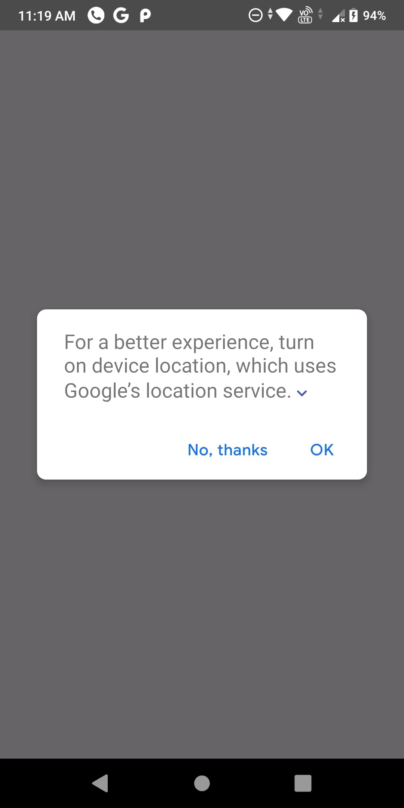
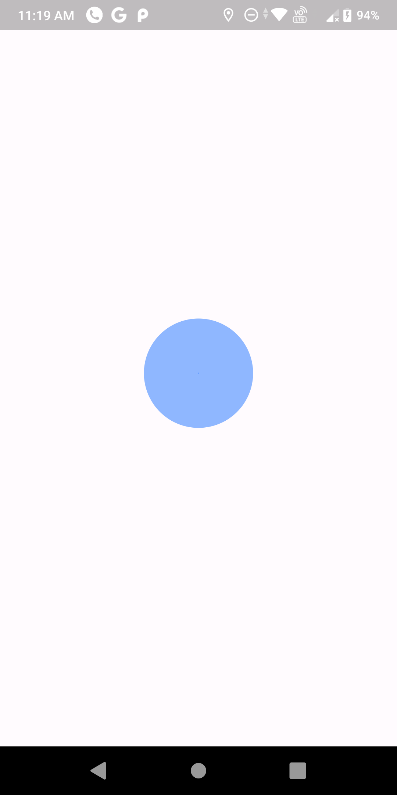
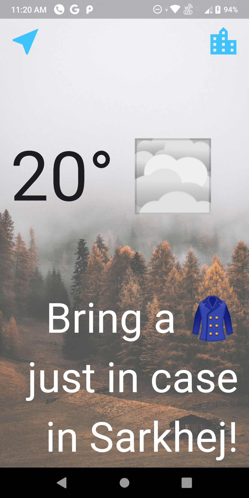
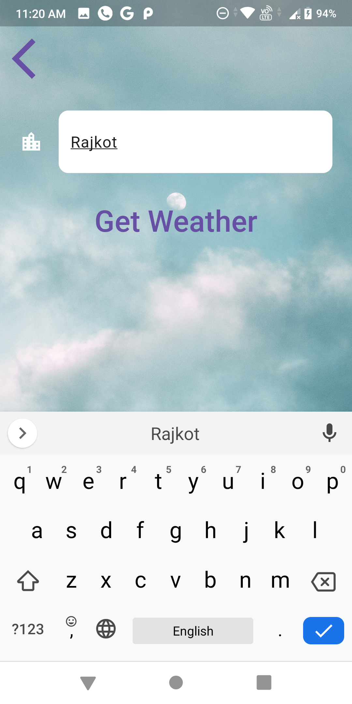
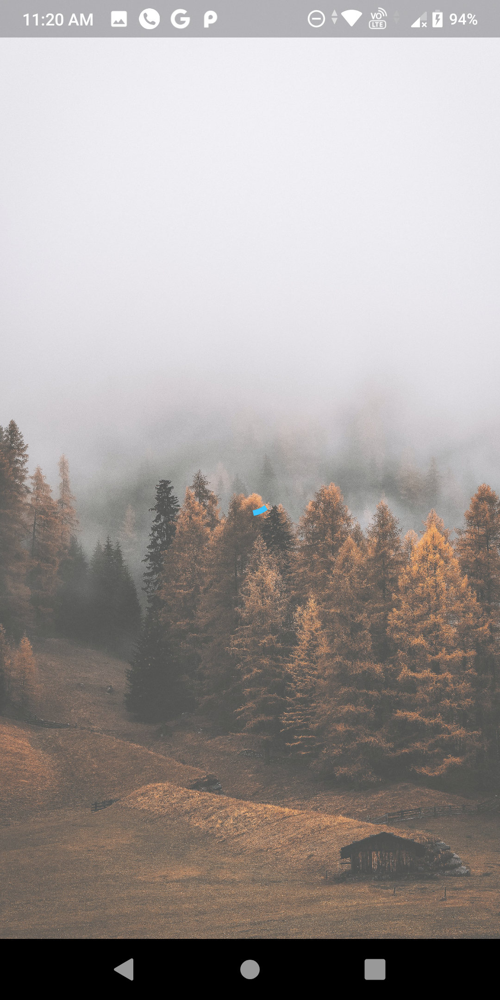
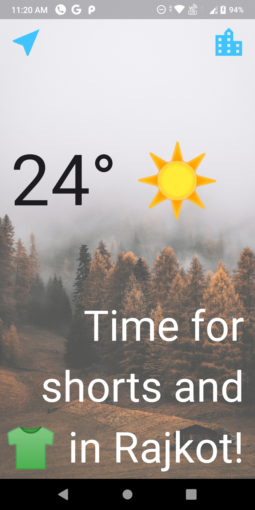

# Weather Application

- This project is built using GetX State-Management tool and OpenWeather API.

- In this project MVC architecture is being followed.

- Utils folder contains all important utility like constants value, networking data and model for response data

- Sceens folder sub folder for each screen and sub folder contains folder like Model (contains model of data that would be used), View (UI part which would be displayed on screen) and Controller (which contains all API/Backed related stuff).

- Create a .env file in project directory.

- Create variable named API_KEY in .env and run the project

# Demo

1. Loading Screen: Here current location weather data is being g=fetched  
&nbsp;&nbsp; &nbsp;&nbsp;
  

2. Home page: Here weather is being displayed  
  

3. Serching City Page: This page can be access by clicking office icon on Top-Righ Corner. 
 

4. Once we click on Get Weather button loading screen will appear and weather data will be fecthed 
 

5. Displaying Weather data for city entered in Searching City Page 
 

### Note:

- A demo video is present in ScreenShot directory